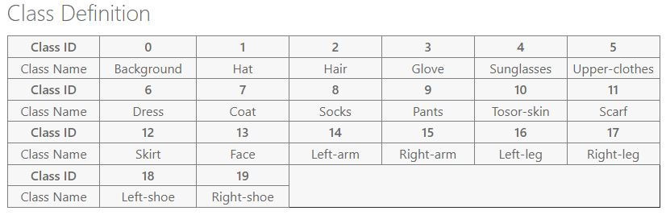

# Multipage-Model-Demo-App
A multipage demo inference application of different deep learning models built with Streamlit library. The app is built using **Python 3.9.13**.
Here's the [app](https://adnan33-plant-disease-detector-app-srcapp-eud76f.streamlitapp.com/)

## Models/Projects
Following model/project demos are added here. It will be updated after each project.

1. **Cloth Segmentation Model**
2. **Human Parsing Model** 

## Model/Project details
Here are some brief details of each model/project:
### Cloth Segmentation Model
##### Dataset
This is a *binary semantic segmentation* model trained on a dataset of single clothing article images. To specify, I used the 
cloth images and masks from the [VITON PLUS](https://www.kaggle.com/datasets/rkuo2000/viton-plus) dataset.
##### Model
 I used the **MANet-EfficientnetB2** architecture for this and trained it for 40 epochs on the dataset. The model metrics are:
```
  'test_DICE': 0.992,
  'test_IOU': 0.984,
  'test_TREVSKY': 0.989,
  'test_loss': 0.0265
```
The model is trained with pytorch and converted to onnx (with optimization) to speed up inference.
Try it out with a demo image(included with the app) or your own images [here].(1/Cloth_Segmentation)

### Human Parsing Model
##### Dataset
This is a *multi class semantic segmentation* model to solve the human parsing task. For this model, I have used the
[Look Into Person (LIP)](https://gas.graviti.com/dataset/graviti/LIP) dataset. This version of the dataset has 25000 training,
2500 validation and 2500 test multi person images and corresponding pixel level annotations. The dataset has 20 different human parts annotated. The class 
labels are given below. You can read more about it from [here](https://competitions.codalab.org/competitions/23433).

##### Model
Current model is based on **UNET++-EfficientnetB3** architecture and trained for 24 epochs. The model is trained with pytorch and converted to onnx (with optimization) to speed up inference.\
**Note: This project is still ongoing so the metrics aren't provided as of now.**
